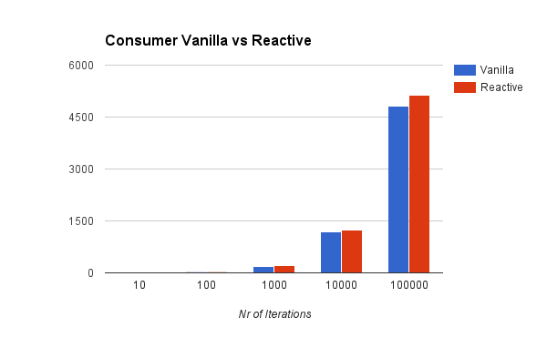

# kafka-performance-tests

Performance tests comparing [reactive-kafka](https://github.com/softwaremill/reactive-kafka) and vanilla kafka High-level-api

This is a fork of [kafka-storm-starter](https://github.com/miguno/kafka-storm-starter) because it contains nice utilities (kafka embedded, zookeeper embedded), etc

---

# Test Cases
The tests use kafka 0.8.2.2 and reactive-kafka 0.8.5-SNAPSHOT (which uses akka-streams 2 and grapstage)

## Consumer

    $ src/test/scala/com/miguno/kafkastorm/integration/KafkaConsumerMain.scala

This test case creates a consumer on topic "topic" and tests it by creating a producer that sends N messages to that topic. KafkaConsumerMain uses the vanilla API, and ReactiveKafkaConsumerMain uses the reactive-kafka API. We measure the consumer throughput by recording the messages received by the consumer.

## ConsumerProducer

    $ src/test/scala/com/miguno/kafkastorm/integration/KafkaConsumerProducerMain.scala

This test case creates a consumer on topic "topicIn" and a producer on topic "topicOut"; whenever a message is received by the consumer in "topicIn" it publishes the same message on "topicOut".

This "flow" is tested by creating a producer that sends N messages to "topicIn" and a consumer on "topicOut". We measure the flow throughput by recording the messages received by the "topicOut" consumer.

# Results

## Consumer

Nr of messages  | vanilla api (rps) | reactive-kafka api (rps) |
--------------- | -----------------:| ------------------------:|
10     | 3.50     | 3.28 
100    | 23.43    | 24.71 
1000   | 193.64   | 199.77 
10000  | 1,190.04 | 1,246.79 
100000 | 4,822.18 | 5,137.33 

## ConsumerProducer

Nr of messages  | vanilla api (rps) | reactive-kafka api (rps) |
--------------- | -----------------:| ------------------------:|
10     | 2.98     | 2.94 
100    | 18.06    | 17.52 
1000   | 145.40   | 132.10 
10000  | 852.39   | 666.82 
100000 | 3,605.77 | 2,072.56 

