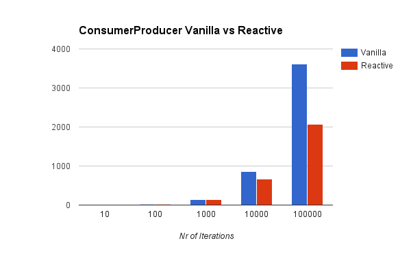

# kafka-performance-tests

Performance tests comparing [reactive-kafka](https://github.com/softwaremill/reactive-kafka) and vanilla kafka High-level-api

This is a fork of [kafka-storm-starter](https://github.com/miguno/kafka-storm-starter) because it contains nice utilities (kafka embedded, zookeeper embedded), etc

---

# Test Cases
The tests use kafka 0.9.0.0 and reactive-kafka 0.9.1-SNAPSHOT (which uses akka-streams 2 and grapstage)

## Consumer

    $ src/test/scala/com/miguno/kafkastorm/integration/KafkaConsumerMain.scala

This test case creates a consumer on topic "topic" and tests it by creating a producer that sends N messages to that topic. KafkaConsumerMain uses the vanilla API, and ReactiveKafkaConsumerMain uses the reactive-kafka API. We measure the consumer throughput by recording the messages received by the consumer.

## ConsumerProducer

    $ src/test/scala/com/miguno/kafkastorm/integration/KafkaConsumerProducerMain.scala

This test case creates a consumer on topic "topicIn" and a producer on topic "topicOut"; whenever a message is received by the consumer in "topicIn" it publishes the same message on "topicOut".

This "flow" is tested by creating a producer that sends N messages to "topicIn" and a consumer on "topicOut". We measure the flow throughput by recording the messages received by the "topicOut" consumer.

# Results

## Consumer

Nr of messages  | vanilla api (rps) | reactive-kafka api (rps) |
--------------- | -----------------:| ------------------------:|
10     | 2.54     | 1.46
100    | 22.73    | 14.93
1000   | 227.74   | 140.99
10000  | 1,286.33 | 1,196.80
100000 | 4,918.49 | 4,814.38

## ConsumerProducer

Nr of messages  | vanilla api (rps) | reactive-kafka api (rps) |
--------------- | -----------------:| ------------------------:|
10     | 2.43     | 1.29
100    | 20.49    | 13.95
1000   | 159.76   | 137.55
10000  | 977.11   | 1,135.32
100000 | 3,964.75 | 3,693.20

